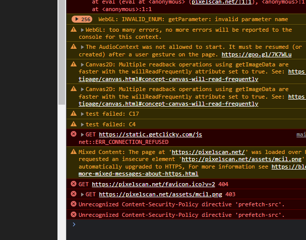

# Task description

Есть сайт-чекер который проверятет твой браузер
https://pixelscan.net/

При открытии девтулз в Chrome в режиме инкогнито мы можем увидеть что у нас есть какие-то падающие тесты

Задача:
1) Узнать сколько вообще этих С<Number> тестов есть
2) Раскопать что проверяют эти тесты С16 и С17 и рассказать почему мы на них проваливаемся.

# Task resolve

## List of failed tests

## List of tests

- SCROLL_TO_TEXT_FRAGMENT = 'C1'
- OPTIONAL_CHAINING = 'C2'
- WEBRTC_LEAK = 'C3'
- GOOGLE_SPEECH_VOICES = 'C4'
- MARKER_PSEUDO = 'C5'
- MICROSOFT_SPEECH_VOICES = 'C6'
- PDF_PLUGIN = 'C7'
- NAVIGATOR_SCHEDULING = 'C8'
- OPERA_HIDE_CHROME_AD = 'C9'
- MIXED_CONTENT_IMAGE_LOADING = 'C10'
- IS_MOBILE = 'C11'
- IS_IOS = 'C12'
- IS_ANDROID = 'C13'
- CANVAS_NOISE = 'C14'
- INVALID_UA = 'C15'
- SAFE_BROWSER_PROTECTION = 'C16'
- MEDIA_DEVICES = 'C17'
